 # Ayesha Auto Reseller

## How to use this project

1. Clone the GitHub repository to your local machine.

   ```bash
   git clone https://github.com/AbuSuraj/Ayesha-Auto-Resaller-client.git

2. Navigate to the project directory.

   ```
    cd Ayesha-Auto-Resaller-client.

3. Install the project dependencies using npm.
   ``` 
   npm install.
4. Run the following command
   ```
   npm start
 ## Admin credentials
<li>adminEmail:< abusurajbd@gmail.com > </li>
<li>adminPassword:<@bSuraj123></li>
<li>Please Turn off your add blocker</li>

## Project live site link:
  
<li>
This project hosted in firebase. <br/>
 Live site link-1: https://asyesha-auto-reseller.web.app/

 Live site link-2: https://asyesha-auto-reseller.firebaseapp.com/
 
Backend Code: https://github.com/AbuSuraj/Ayesha-Auto-Resaller-server
</li>

## React Features Used in this application

###  State Mangement 
 #### Context Api: <b>used in AuthProvider.js </b>
The AuthProvider employs React Context for global state management, centralizing authentication state and ensuring seamless access to user information and authentication status across the entire application.
 ###  UseState
 Throughout the entire project, the ubiquitous use of useState hooks enables dynamic state management, allowing components to maintain and update their local state, enhancing responsiveness and interactivity within the application. 
### Routing
   
 I configure React routes with react-router-dom, organizing components for a main layout, blog, authentication forms, home page, and a detailed dashboard. It supports private routes for authenticated users and admin-specific routes, improving overall user and administrative experience.
### Route Guard
    
 I define a PrivateRoutes component that serves as a guard for rendering private content in a this application. It utilizes the useContext hook to access authentication information from the AuthContext.
### Fetching 

1.  ####  ``` useEffect ```: it is used to perfrom side effects.
    Used in checkOut, authProvider, custom hook (useAdmin, useSeller, useToken, useBuyer) etc.

2. #### ``` tanstack query ```: this library is used for efficient and declarative data fetching, caching, and state management.
    used in AllBuyers, AllSellers, MyOrders, MyProducts, Product, Categories and so on. 
3. #### ``` axios```: simplifying API interactions and enhancing code readability  
   used in AddAProduct componet.
4.  #### ``` loader ``` : The useLoaderData hook from react-router-dom is used to retrieve booking data
## Project Description
<li>A simple Resale Car website made with using MERN Stack technology.</li>

### authenctication
<div>
<li>To sign up there is a option for account type- buyer and seller. By default and google sign up is considered as buyer.</li>
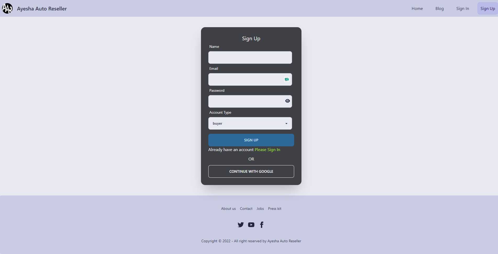
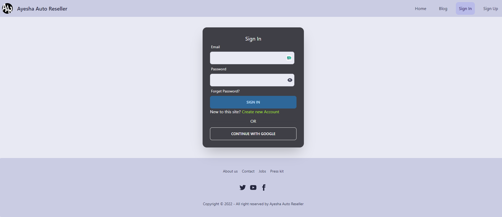
</div>
<div>

### Home
<li>Home page have a few section such as banner, Cars cateogry, FAQ, and Advertisement.</li> 
<li>Navbar have some routes, among them  Dashboard is private, others public routes are home, Blog, Sign In, and Sign Up.</li> 
<li>Categories are  shown on the home page, moreover, if user click <b>"See All Cars"</b> then one  can see available all cars for this category.</li> 
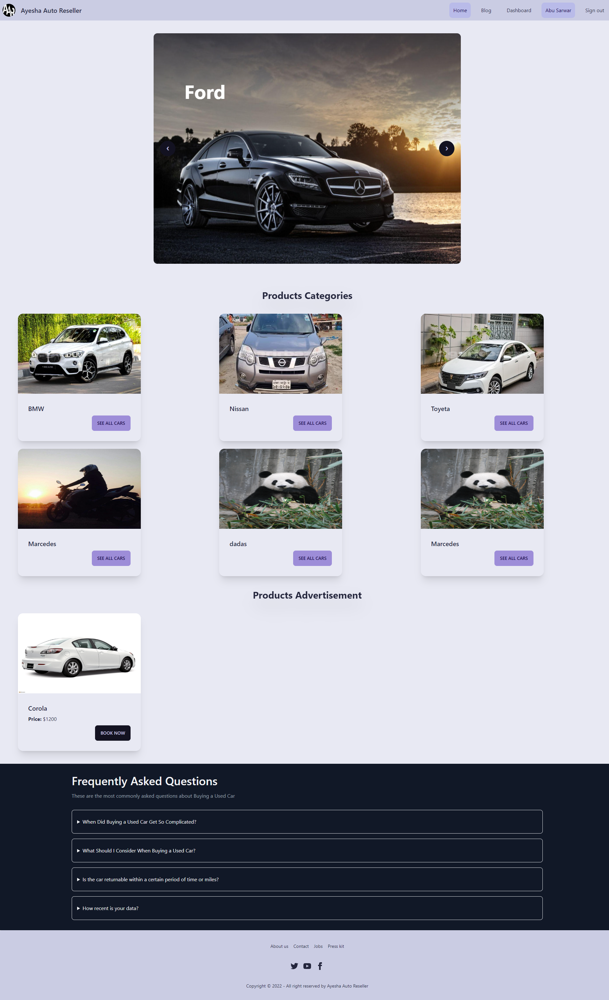
</div>

### categorires
<div>
<li>In category wise car page, there are details information for the available cars. Additionally, if the seller is verified then there is verified icon next to the sellers name.</li> 
<li>In addition, in the bottom of the each car, there are two buttons, Book Now and report this item.</li>
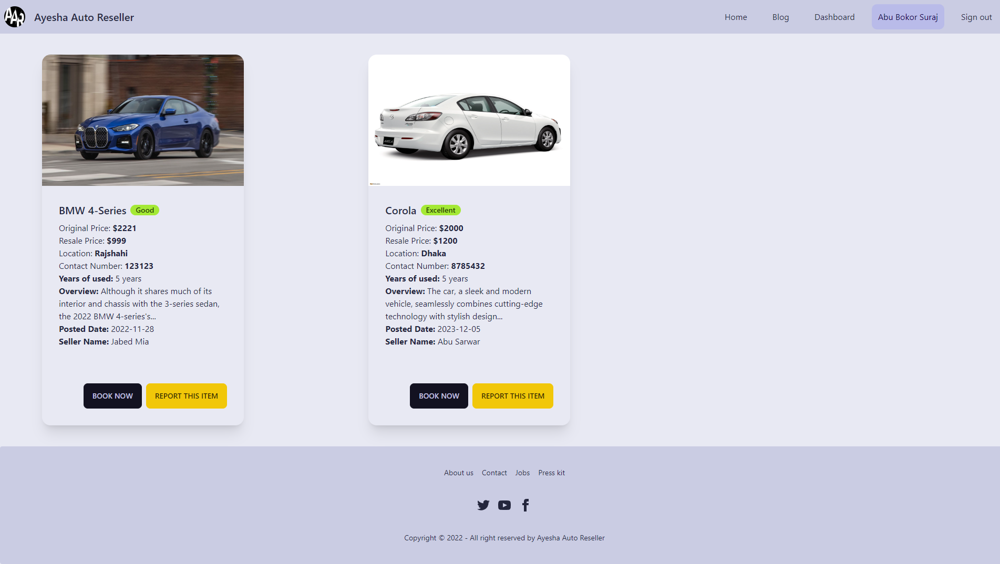

<li>Clicking on the <b>BOOK NOW</b> button there will be a modal with booking form </li>
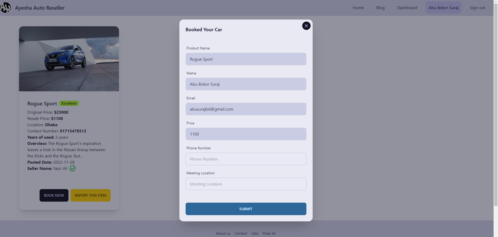
<li>Clicking on the <b>REPORT THIS ITEM</b> button will send a report to admin & added in the report list, admin can delete this reported product.  </li>
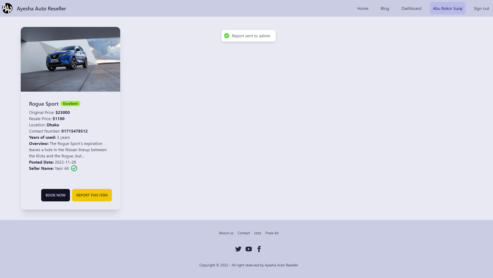
</div>

### Dashboard
<section>
<li>Dashboard menu is changed in accordance with account type.</li>

#### admin
<div>
<li>Admin has access all sellers, all buyers, reportem item lists and add a category </li>
<li>can delete a seller, and a buyer, can verify a seller, can add a category.</li>  
<li>All Sellers</li>
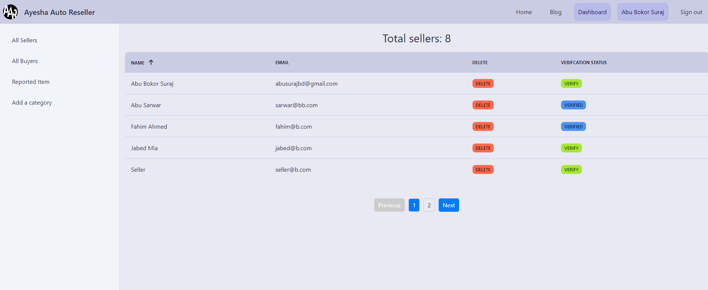
<li>All Buyers</li>
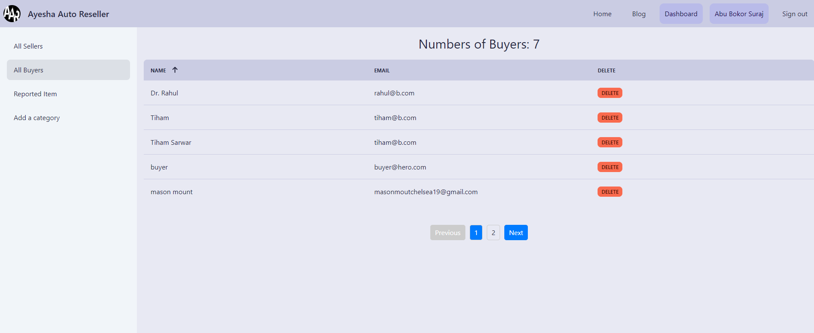
<li>Reported Item </li>
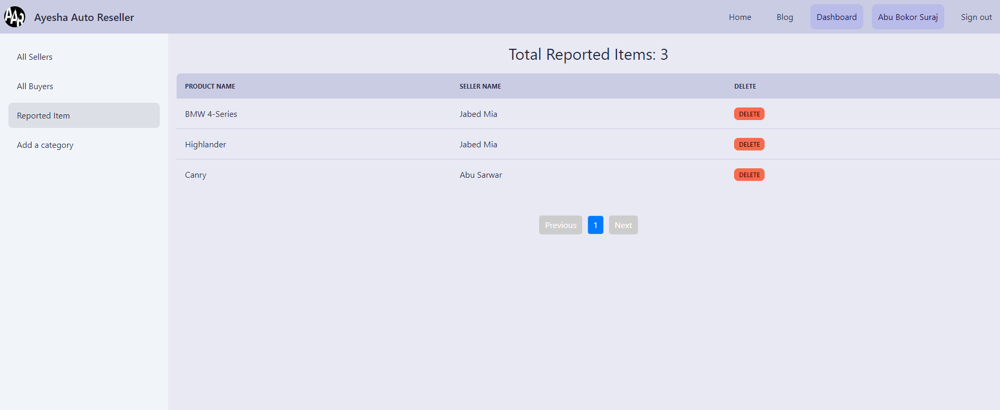
<li>Add a Category </li>
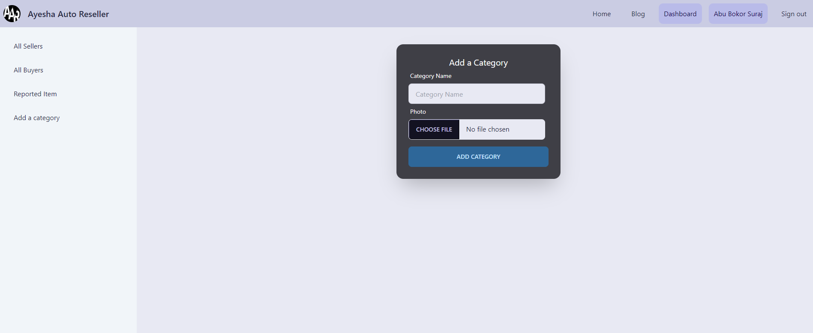
</div>

<div>

#### Seller
<li>Seller can add a product, can send a product for addvetisement, can delete a product.</li>
<li>If a seller want then he can advertise his unsold car, and this item is added into the home page advertisement section.</li>
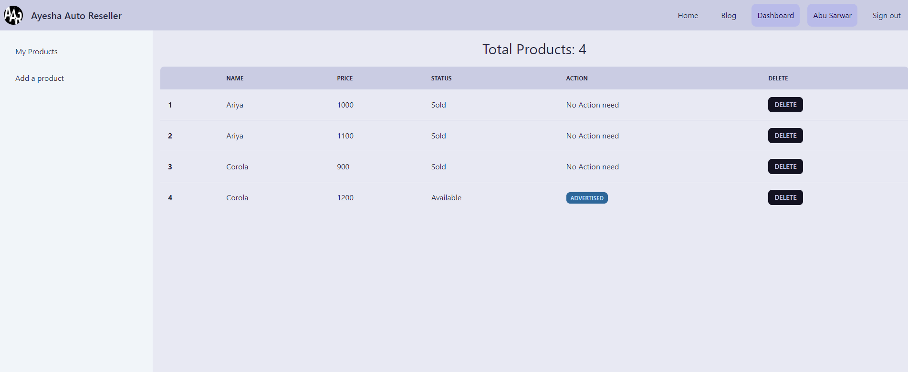
<li>Adding a product by Seller</li>
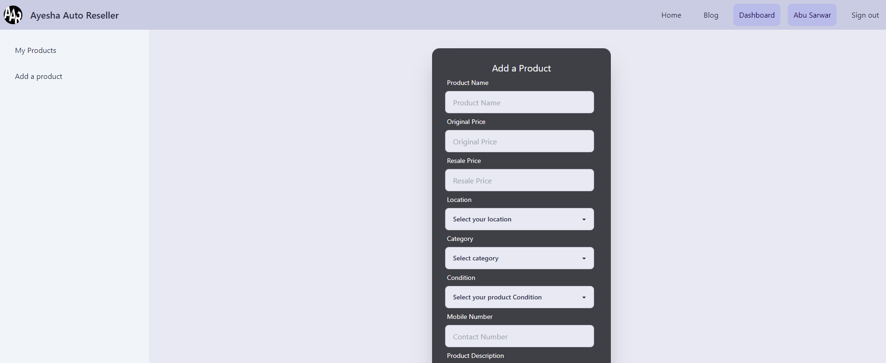
</div>

<div>

### Buyers
<li>If the buyer, booked a car then it is available in  My Orders.</li>
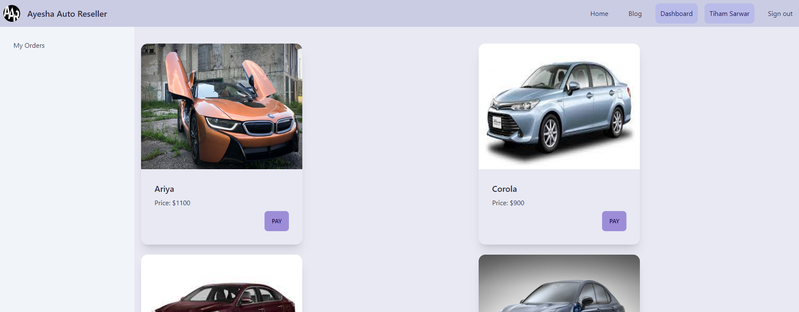
<li>Clicking in Pay button, will take buyer to card payment system</li>
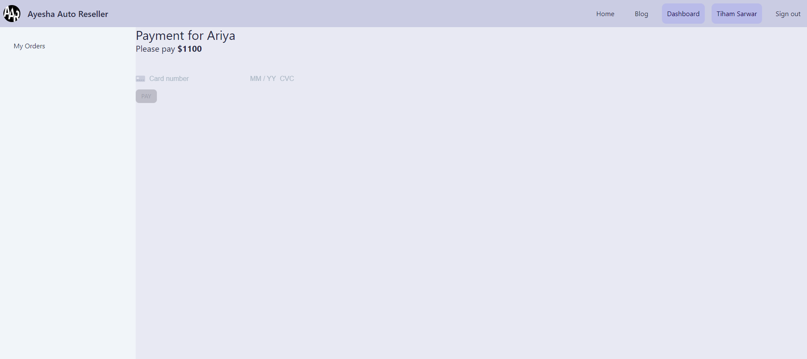
</div>
</section>

<!-- <li>"Report This Item", will send a report to admin, admin can delete this reported Item.</li> -->
<li>Login is must needed to Book a car.</li> 


<li>Dynamic page title is also available.</li> 
<li>Sensetive information are kept away from public with the help of environment varibale.</li>


### Used Resources 
<li>Firebase: https://firebase.google.com/</li>
<li>React Router Dom: https://reactrouter.com/en/main</li>
<li>Tailwind CSS: https://tailwindcss.com/</li>
<li>React Icons: https://react-icons.github.io/react-icons/</li>
<li>React Hot-toast: https://react-hot-toast.com/</li>
<li>LottieFiles: https://lottiefiles.com/animation/react</li>
<li>AOS: https://michalsnik.github.io/aos/</li>
<li>sweetalert2: https://sweetalert2.github.io/</li>
<li>React-Photo-view: https://react-photo-view.vercel.app/docs/getting-started</li>
<li>React Hook form: https://react-hook-form.com/get-started/</li>
<li>React Query  https://tanstack.com/query/v4/docs/quick-start</li>
<li>date-fns: https://www.npmjs.com/package/date-fns/</li>
<li>Stripe: https://stripe.com/docs</li>


 
